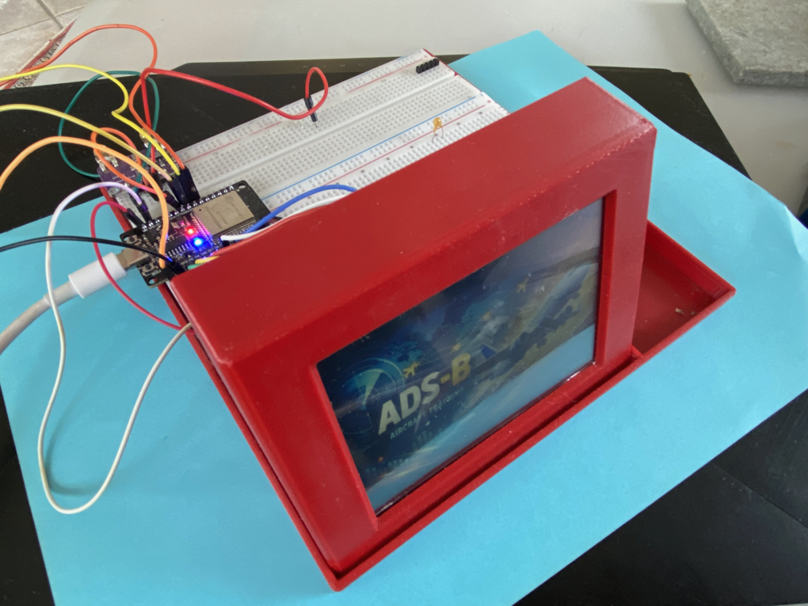
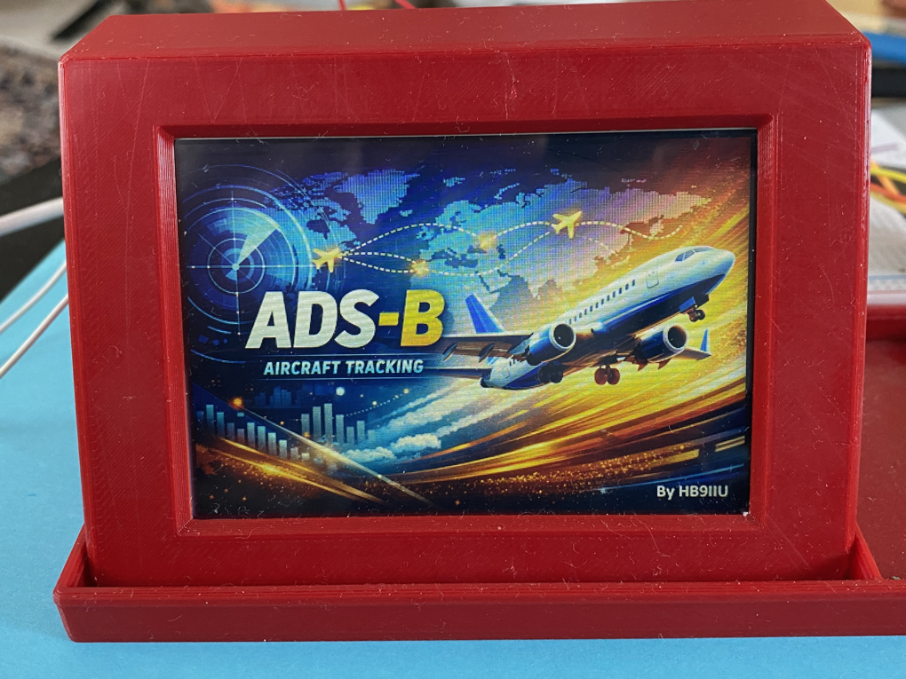
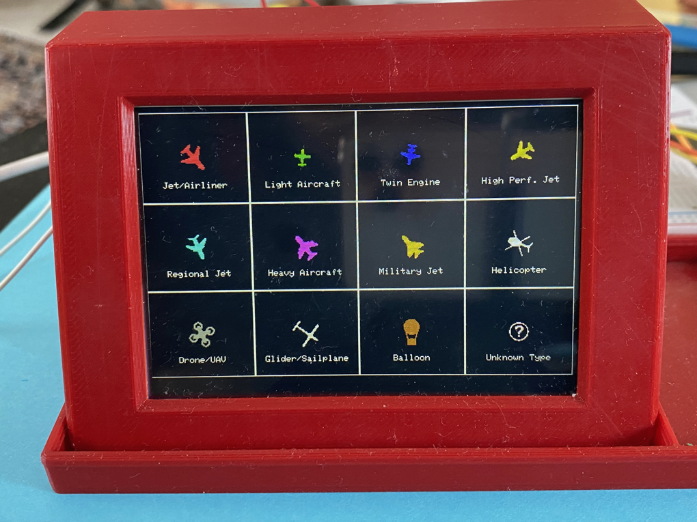
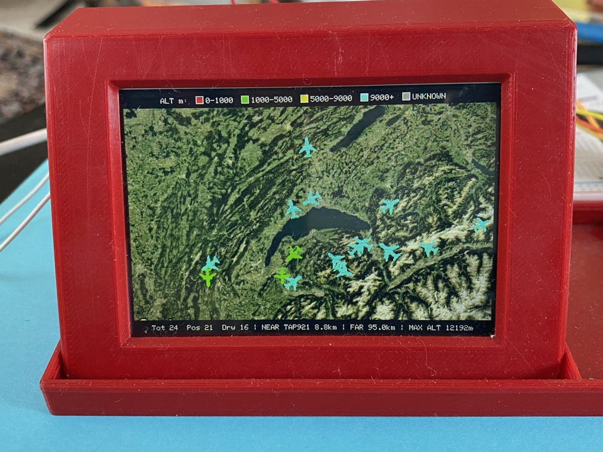
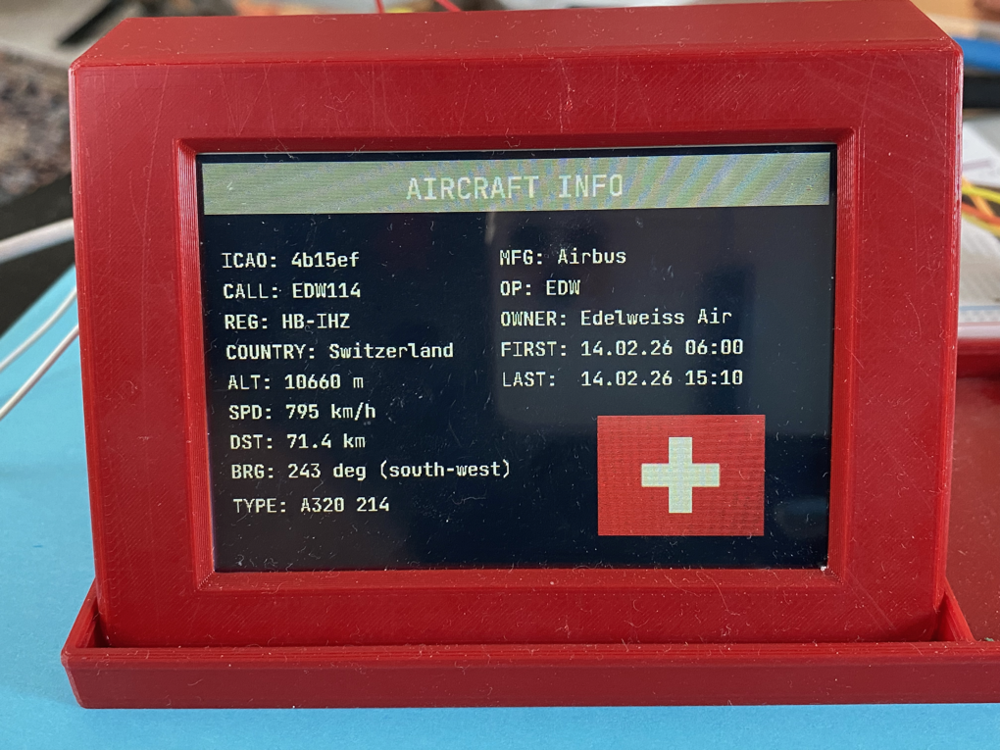
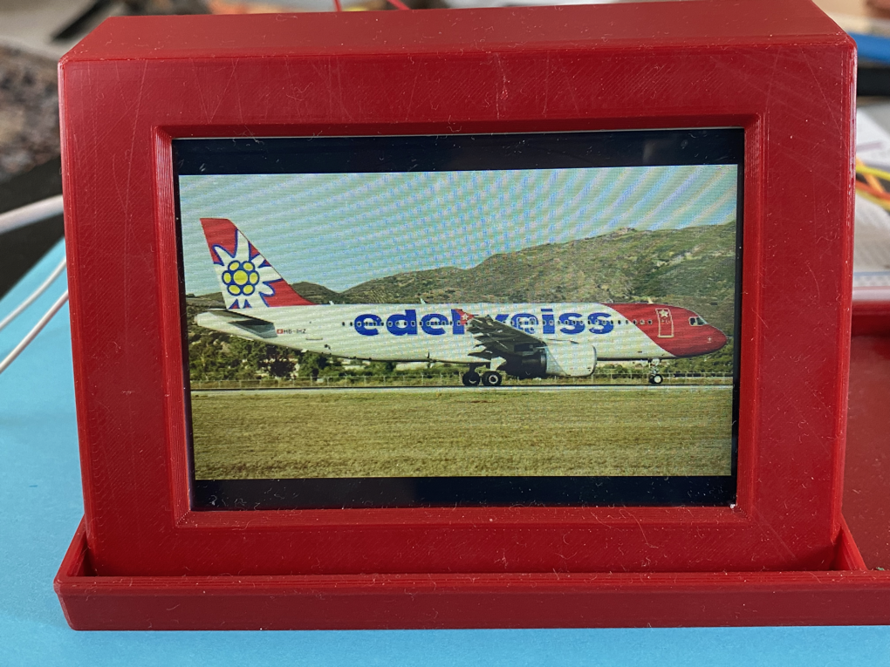
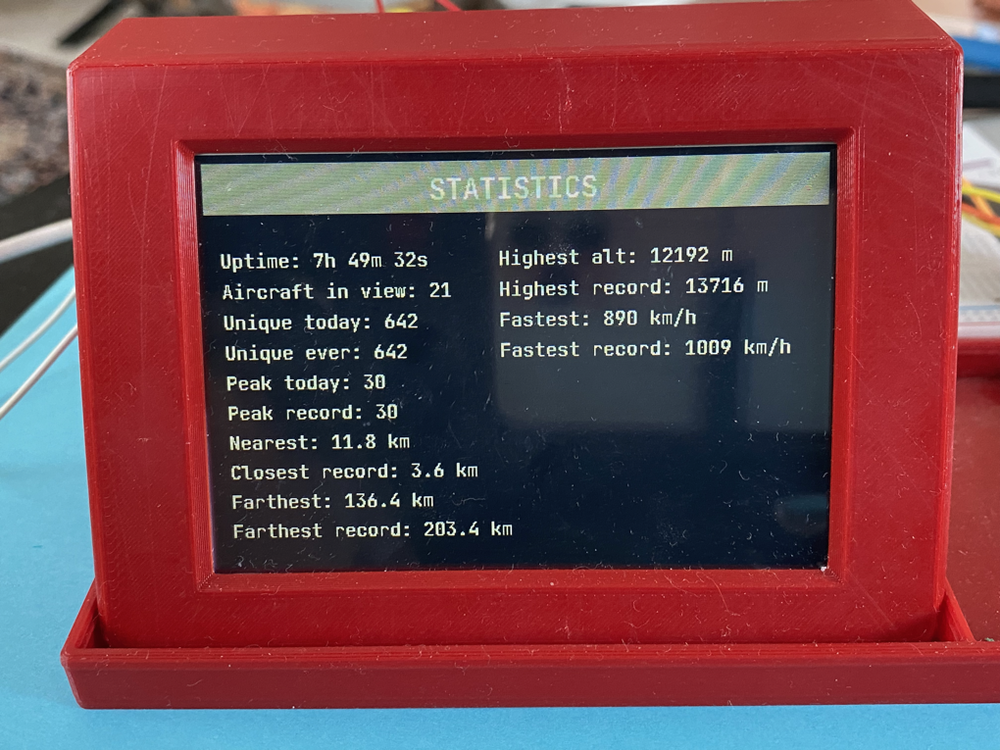
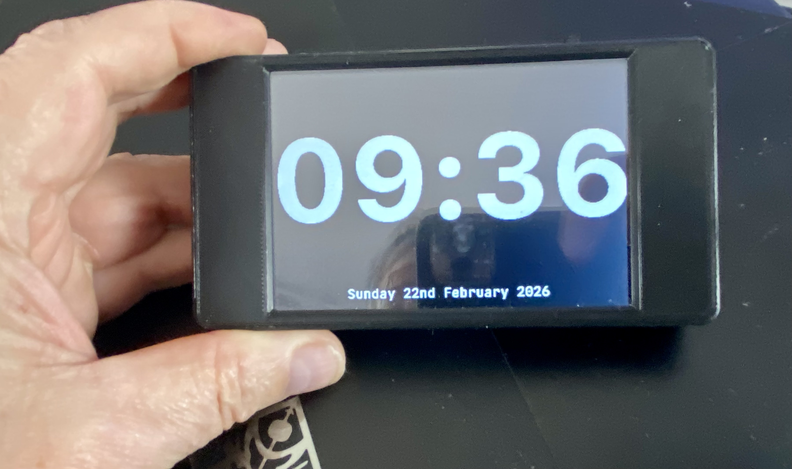
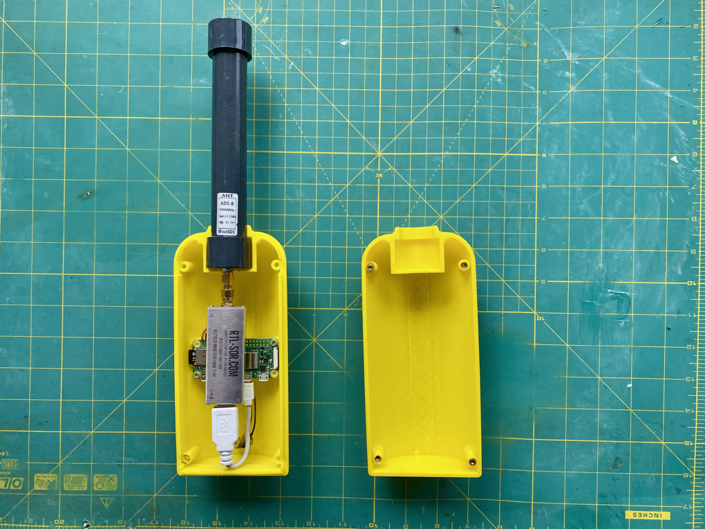
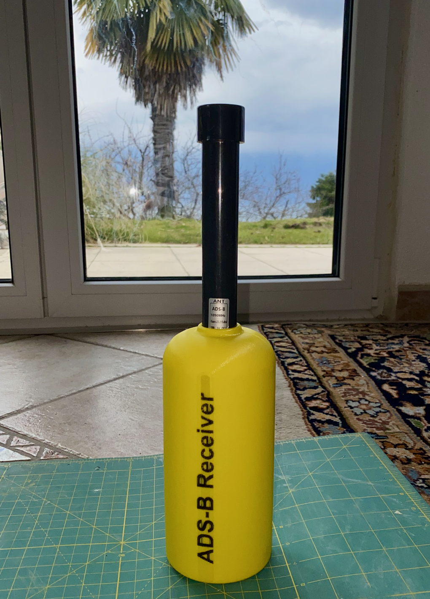

# ESP32 ADS-B Companion (4" TFT Plane Radar)

A Wi-Fi-enabled ESP32 firmware for a 480×320 TFT display, visualizing live aircraft positions from a local ADS-B receiver (tar1090/dump1090). The firmware renders a static map background, tracks up to 200 aircraft simultaneously, and displays heading-oriented icons coloured by altitude. A full touch UI provides plane selection, multi-page info browsing, brightness control, and a customisable screensaver clock — all with persistent settings.

**Key features at a glance:**
- Live aircraft JSON fetched every 2 seconds
- Plane icons oriented by heading, coloured by altitude band
- Touch: select aircraft, browse info/image/stats pages, adjust brightness
- Screensaver clock with large font, outdoor temperature, cycling digit colours
- Separate brightness levels for main page and clock page (saved to NVS)
- Captive portal for first-boot Wi-Fi configuration
- Automatic timezone detection and NTP time sync
- Map background generated externally (see pythonTools)
- PlatformIO build targets for multiple ESP32/TFT variants

---

## Usage Modes

- **Basic Mode:**
  Works with any ADS-B receiver exposing `aircraft.json` (e.g. tar1090/dump1090).
  Only the main radar screen is available (aircraft positions, headings, altitude colours).

- **Full Mode (Recommended):**
  Use together with the provided Raspberry Pi package (`RPI_ADSB_install_script`).
  Unlocks all screens: aircraft info, country flags, route detail, aircraft images, statistics.

---

## First Boot — Wi-Fi Setup (Captive Portal)

On first boot (or after a factory reset), the device launches a Wi-Fi access point named **`cyd-demo`**.

1. Connect to the `cyd-demo` Wi-Fi network from your phone or computer
2. A captive portal page opens automatically (or browse to `192.168.4.1`)
3. Enter your Wi-Fi network name and password and save
4. The device reboots and connects to your network

**Factory reset:** Hold the touch screen at boot to erase all saved settings and re-launch the captive portal.

---

## Automatic Time Synchronisation

After connecting to Wi-Fi the device automatically:

1. Queries [open-meteo.com](https://open-meteo.com) using `HOME_LAT` / `HOME_LON` to determine the correct local timezone and UTC offset (DST-aware)
2. Synchronises time via NTP (`pool.ntp.org`, `time.nist.gov`, `europe.pool.ntp.org`)

No manual timezone configuration is required. The correct local time is used by the screensaver clock and all metadata timestamps.

---

<table align="center">
  <tr>
    <td align="center">
      <br/>Prototype
    </td>
    <td align="center">
      <br/>Splash Screen
    </td>
    <td align="center">
      <br/>Symbols Legend
    </td>
    <td align="center">
      <br/>Main Radar Page
    </td>
    <td align="center">
      <br/>Aircraft Info Page
    </td>
  </tr>
  <tr>
    <td align="center">
      <br/>Aircraft Picture
    </td>
    <td align="center">
      <br/>Statistics
    </td>
    <td align="center">
      <br/>Screensaver Clock
    </td>
    <td align="center">
      <br/>Receiver
    </td>
    <td align="center">
      <br/>STL files Included
    </td>
  </tr>
</table>

---

## Hardware

### Supported displays / targets

1. **CYD 4" integrated board (ST7796)**
   PlatformIO env: `cyd4_st7796`

2. **External 4" TFT (ILI9488) + standard ESP32 DevKit** (TFT_DC = GPIO5)
   PlatformIO env: `ext_ili9488_dc5`

3. **External 4" TFT (ILI9488) + ESP32U / antenna variant** (TFT_DC = GPIO0)
   PlatformIO env: `ext_ili9488_dc0_antenna`

4. **External 4" TFT (ILI9488) IPS type + standard ESP32 DevKit** (TFT_DC = GPIO5)
   PlatformIO env: `ext_ili9488_dc5_IPS`

**Wiring diagrams:** See [doc/Diagrams/ConnectionDiagram.pdf](doc/Diagrams/ConnectionDiagram.pdf) for detailed ESP32-to-TFT wiring.

---

## Pages Overview

### Main Radar (PAGE_MAIN)
Live aircraft map with up to 99 visible planes per frame. Each icon is:
- **Heading-oriented** (rotates with track angle)
- **Colour-coded by altitude:**

| Colour | Altitude range |
|--------|---------------|
| Red    | 0 – 1 000 m   |
| Green  | 1 000 – 5 000 m |
| Yellow | 5 000 – 9 000 m |
| Cyan   | 9 000 m+      |
| Dark grey | Unknown  |

A **legend bar** at the top shows colour swatches. A **status bar** at the bottom shows live counts and selected aircraft info. Rendering uses a **dirty-rect system** — only changed regions are redrawn, with no full-screen flicker.

**Touch — Main Radar:**
- Tap an aircraft icon → selects it, shows 4-second info banner, switches to Aircraft Info page
- **Upper-left corner (40×40 px):** Hold to dim brightness (−5% per step, min 3%)
- **Upper-right corner (40×40 px):** Hold to brighten (+5% per step, max 100%)

---

### Aircraft Info (PAGE_2)
Detailed info panel for the selected aircraft:
- ICAO hex, callsign, registration, country flag (JPEG from Pi server)
- Altitude (m), speed (km/h), distance from home (km), bearing (degrees + compass)
- Aircraft type, manufacturer, operator, registered owner, first/last seen
- **Route detail** fetched from the Pi's routeFinder service (port 6969) — shows departure/destination while displaying "Searching Route Detail..." during fetch

Touch → advances to Aircraft Picture page.

---

### Aircraft Picture (PAGE_3)
Full-screen aircraft photo (JPEG) fetched from the Pi server. Touch → advances to Statistics page.

---

### Statistics (PAGE_4)
Live and all-time records from the Pi:
- Aircraft in view, unique today, unique ever, peak today, peak record
- Nearest / farthest aircraft (km), with records
- Highest altitude (m), fastest speed (km/h), with records
- Server uptime

Touch → returns to Main Radar.

---

### Screensaver Clock (PAGE_CLOCK)
Activates automatically after **60 seconds** of no touch. Displays:

1. **HH:MM** in a large monospace font (SF Mono Semibold, 124 px), centered on screen
2. **Outdoor temperature** ("Temp. 12.3 deg. C") fetched from open-meteo every 15 minutes, displayed above the date
3. **Full date** ("Sunday 22nd February 2026") with correct ordinal suffixes, anchored to the bottom

**Partial refresh:** Only the digit(s) that actually changed are redrawn each minute — no full-screen flicker.

**Touch controls on the clock page:**

| Zone | Action |
|------|--------|
| Upper-left corner (40×40 px) | Hold to dim brightness |
| Upper-right corner (40×40 px) | Hold to brighten |
| Upper-centre (80×40 px) | Tap to cycle digit colour |
| Anywhere else | Return to Main Radar |

**Digit colour palette** (10 colours, cycles on each centre tap):

| # | Colour  | # | Colour   |
|---|---------|---|----------|
| 0 | White   | 5 | Blue     |
| 1 | Yellow  | 6 | Purple   |
| 2 | Lime    | 7 | Magenta  |
| 3 | Green   | 8 | Red      |
| 4 | Cyan    | 9 | Orange   |

---

## Persistent Settings (NVS)

All user preferences are saved to ESP32 non-volatile storage (NVS namespace `"ui"`) and restored automatically at boot or on page re-entry.

| NVS key  | Description | Default |
|----------|-------------|---------|
| `bl`     | Main page brightness (%) | Platform default |
| `bl_clk` | Clock page brightness (%) | 30% |
| `cl_clk` | Clock digit colour index (0–9) | 0 (White) |

**Brightness behaviour:** When the screensaver activates, the main brightness is saved and the clock brightness is applied. When returning to the main page, the main brightness is restored. Each level is saved independently after 5 seconds of inactivity.

---

## Configuration

All user-specific settings are in **`src/Config.h`**. You **must** update this file before compiling.

Key settings:

```cpp
// Your location (map centre, distance/bearing reference, meteo temperature)
static const double HOME_LAT = 46.4717185;
static const double HOME_LON = 6.4767709;

// ADS-B data source (must serve tar1090/dump1090 aircraft.json)
static const char* ADSB_JSON_STREAM_URL = "http://192.168.0.98/tar1090/data/aircraft.json";

// Must match the generated background565.h exactly
static const int    MAP_ZOOM = 8;
static const double MAP_PX0  = 33707.06016028444;
static const double MAP_PY0  = 23031.052289240848;
```

---

## Map Background Generator (RGB565)

This project **does not** auto-create the map background. You must generate `background565.h` for **your own location** using the included Python tools.

### Where the Python tools are

- `pythonTools/GoogleMaps.py` — uses Google Static Maps (API key required)
- `pythonTools/OpenStreetMaps.py` — uses OpenStreetMap tiles (no API key)

Both scripts produce the same output:
- `src/background565.h` — 480×320 RGB565 image

### How to use

Open the script and edit the user settings at the top:

```python
CENTER_LAT = 46.4717185
CENTER_LON = 6.4767709
RANGE_KM   = 80
```

For GoogleMaps.py also set:

```python
GOOGLE_MAPS_KEY = "YOUR_GOOGLE_STATIC_MAPS_API_KEY_HERE"
```

> Google may require billing to be enabled even within the free tier.

### After generating the background

Update `Config.h` with the `MAP_ZOOM`, `MAP_PX0`, `MAP_PY0` values printed by the script. If these do not match, aircraft icons will not align with the map.

---

## Build & Upload (PlatformIO)

In `platformio.ini`, select your target:

```ini
[platformio]
default_envs = cyd4_st7796
;default_envs = ext_ili9488_dc5
;default_envs = ext_ili9488_dc0_antenna
;default_envs = ext_ili9488_dc5_IPS
```

> **Note:** The firmware exceeds 1.75 MB and uses a `huge_app.csv` partition (~3 MB single slot). OTA updates are not possible on 4 MB flash; an ESP32-S3 with 8+ MB flash would be needed.

---

# Raspberry Pi ADS-B Receiver Setup
(readsb + tar1090)

This ESP32 ADS-B Companion requires a local ADS-B receiver on your network providing live aircraft data in JSON format.

---

## Hardware Requirements

- Raspberry Pi Zero 2W (or Pi 3 / Pi 4 / Pi 5)
- MicroSD card
- RTL-SDR dongle (RTL-SDR Blog V4 recommended)
- ADS-B antenna (active antenna optional)
- Ethernet or Wi-Fi network

---

## Operating System

- Raspberry Pi OS Lite (64-bit)
- Debian release: **Trixie** (select "Others" in Raspberry Pi Imager)

Desktop versions are not recommended.

---

## Step 1 — Flash Raspberry Pi OS

1. Install Raspberry Pi Imager
2. Select Raspberry Pi OS Lite (64-bit) / Debian Trixie
3. Recommended: enable SSH, configure Wi-Fi, set username/password
4. Flash the SD card and boot

---

## Step 2 — Install ADS-B Receiver Software

Log in via SSH and run the HB9IIU setup script:

```bash
wget -O hb9iiuADSBsetupRPI.sh \
   https://raw.githubusercontent.com/HB9IIU/ESP32-ADSB_Companion/main/RPI_ADSB_install_script/hb9iiuADSBsetupRPI.sh
chmod +x hb9iiuADSBsetupRPI.sh
sudo ./hb9iiuADSBsetupRPI.sh
```

Press ENTER to accept default values. The script takes up to 12 minutes — do not interrupt it.

The script installs and configures:
- **readsb** — ADS-B decoder
- **tar1090** — web interface + aircraft.json endpoint
- **imageBuilder.py** — generates pre-scaled aircraft images (RGB565 + JPEG)
- **routeFinder.py** — Flask microservice (port 6969) for route/flight detail
- **status_web.py** — system status dashboard (port 8080)
- **lighttpd** — web server for images, flags, metadata, statistics

---

## Step 3 — Verify Installation

After the script completes, the following URLs should be accessible (replace `<PI-IP>` with your Pi's IP address, e.g. `192.168.0.98`):

| URL | Description |
|-----|-------------|
| `http://<PI-IP>/` | Landing dashboard |
| `http://<PI-IP>/tar1090/` | Live aircraft map (tar1090) |
| `http://<PI-IP>/tar1090/data/aircraft.json` | Raw aircraft JSON (used by ESP32) |
| `http://<PI-IP>:8080` | System status (services, metrics) |
| `http://<PI-IP>:6969/api/flight/<icao>` | Route detail (routeFinder) |
| `http://<PI-IP>/stats_tft.json` | Statistics for ESP32 display |

---

## Step 4 — Configure ESP32

Update `src/Config.h` with your Pi's IP address:

```cpp
static const char* ADSB_JSON_STREAM_URL = "http://192.168.0.98/tar1090/data/aircraft.json";
```

---

## Notes

- An active ADS-B antenna is recommended for best reception
- Enable bias-T only when using an active antenna
- The Raspberry Pi and ESP32 must be on the same local network
- Aircraft may take a few minutes to appear after startup
- The Pi Zero 2W CPU is the bottleneck for image generation — not WiFi

---

For bugs, suggestions, or questions, please open an issue on the [GitHub repository](https://github.com/HB9IIU/ESP32-ADSB_Companion/issues).

73 de HB9IIU
